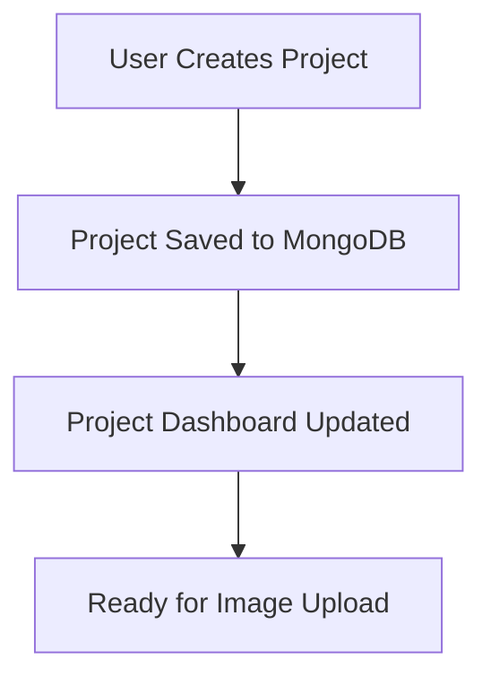
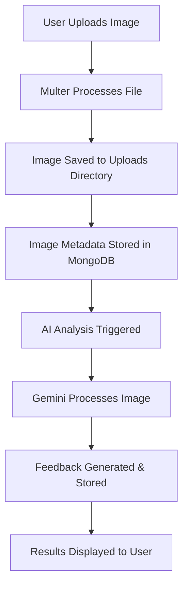
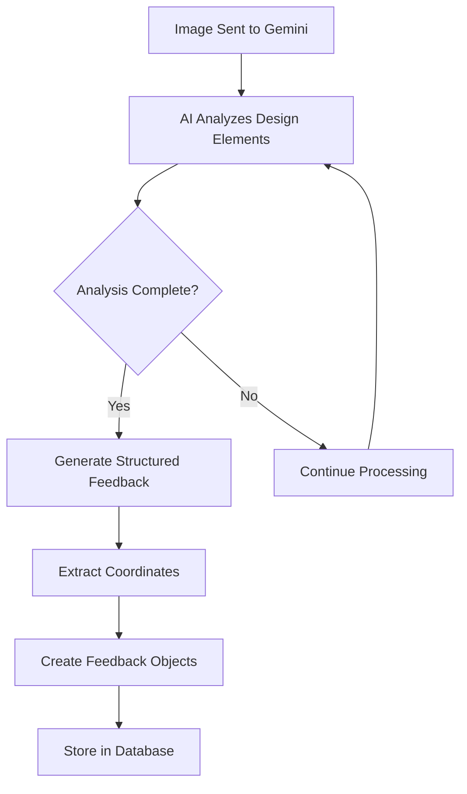
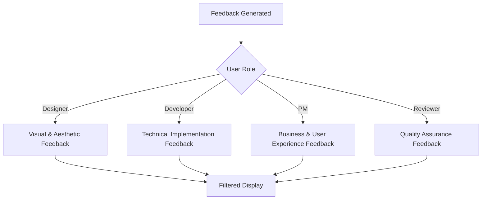
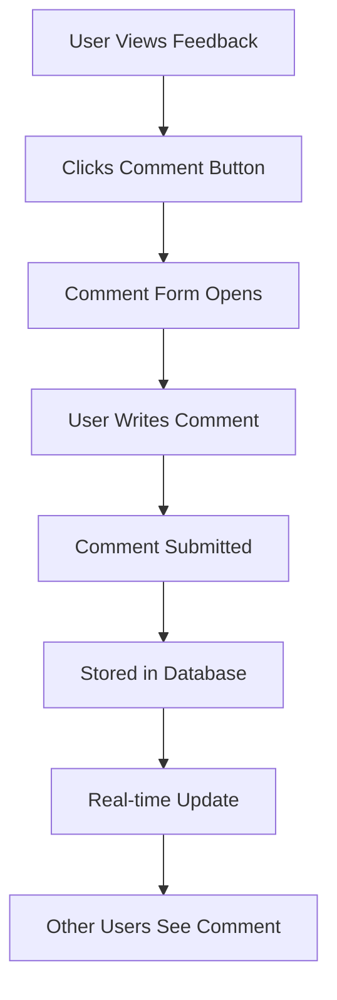

# 🎨 DesignSight - Project Overview & Architecture

## 📋 **Project Summary**

**DesignSight** is an AI-powered design feedback platform that revolutionizes the design review process. It uses Google Gemini 2.0 Flash AI to automatically analyze design screenshots and provide intelligent, coordinate-anchored feedback with role-based filtering and collaborative discussions.

### **Key Features:**
- 🤖 **AI-Powered Analysis** - Automated design feedback using Google Gemini AI
- 📍 **Coordinate-Anchored Feedback** - Precise pixel-level feedback positioning
- 👥 **Role-Based System** - Designer, Developer, PM, and Reviewer perspectives
- 💬 **Collaborative Comments** - Team discussions on feedback items
- 📊 **Export Capabilities** - JSON and PDF feedback reports
- 🔄 **Real-time Updates** - Live feedback and collaboration

---

## 🏗️ **Technology Stack**

### **Frontend** (React Ecosystem)
```javascript
• React 18.2.0           - Modern UI library with hooks
• React Router Dom       - Client-side routing
• Tailwind CSS          - Utility-first CSS framework
• Axios                 - HTTP client for API calls
• Custom Hooks          - Reusable stateful logic
```

### **Backend** (Node.js Ecosystem)
```javascript
• Node.js 18+           - JavaScript runtime
• Express.js            - Web application framework
• MongoDB               - NoSQL document database
• Mongoose              - MongoDB object modeling
• Multer                - File upload middleware
• CORS                  - Cross-origin resource sharing
• dotenv                - Environment variable management
```

### **AI Integration**
```javascript
• Google Gemini 2.0 Flash - Advanced AI model for image analysis
• @google/generative-ai   - Official Google AI SDK
• Vision API             - Image processing and analysis
```

### **Database Schema**
```javascript
• Projects Collection    - Project management
• Images Collection      - Uploaded design screenshots
• Feedback Collection    - AI and user-generated feedback
• Comments Collection    - Collaborative discussions
```

### **DevOps & Deployment**
```yaml
• Docker & Docker Compose - Containerization
• Replit                 - Cloud deployment platform
• MongoDB Atlas          - Cloud database
• Git & GitHub           - Version control
• Environment Variables  - Secure configuration
```

---

## 🔄 **Application Workflow**

### **1. Project Creation Flow**


**Process:**
1. User creates a new project with name and description
2. Project data is stored in MongoDB with unique ID
3. Dashboard displays project with upload capability
4. Project becomes available for team collaboration

### **2. Image Upload & Analysis Flow**


**Detailed Process:**
1. **Upload**: User selects and uploads design screenshot
2. **Storage**: Multer middleware saves file to `/uploads` directory
3. **Database**: Image metadata (name, size, path) stored in MongoDB
4. **AI Trigger**: Google Gemini AI analysis initiated
5. **Processing**: AI analyzes image for design issues and improvements
6. **Feedback Generation**: AI creates structured feedback with coordinates
7. **Storage**: Feedback stored in database with image reference
8. **Display**: Results shown in interactive feedback panel

### **3. AI Analysis Process**


**AI Analysis Categories:**
- **Visual Hierarchy** - Layout, spacing, typography priorities
- **Accessibility** - Color contrast, readability, usability
- **Content** - Text clarity, information architecture
- **UX Patterns** - User experience best practices

### **4. Role-Based Feedback System**


**Role-Specific Focus:**
- **Designer**: Visual hierarchy, typography, color theory, branding
- **Developer**: Implementation feasibility, responsive design, performance
- **Product Manager**: User experience, business goals, feature priorities
- **Reviewer**: Overall quality, consistency, compliance

### **5. Collaborative Comment System**


---

## 🎯 **Data Flow Architecture**

### **Frontend Architecture**
```javascript
// Component Hierarchy
App.js
├── Dashboard.js              // Project overview
├── ProjectDetail.js          // Individual project view
└── ImageAnalysis.js          // Main analysis interface
    ├── Image Display         // Screenshot viewer
    ├── Feedback Panel        // AI feedback list
    ├── Role Selector         // Filter by role
    ├── Comment System        // Collaborative discussions
    └── Export Options        // JSON/PDF download
```

### **Backend API Structure**
```javascript
// API Endpoints
/api/projects
├── GET /                     // List all projects
├── POST /                    // Create new project
├── GET /:id                  // Get specific project
└── PUT /:id                  // Update project

/api/images
├── POST /upload              // Upload image
├── GET /:id                  // Get image details
├── POST /:id/analyze         // Trigger AI analysis
└── GET /:id/file             // Serve image file

/api/feedback
├── GET /image/:imageId       // Get feedback for image
├── POST /                    // Create manual feedback
├── PUT /:id                  // Update feedback
└── DELETE /:id               // Delete feedback

/api/comments
├── GET /feedback/:feedbackId // Get comments for feedback
├── POST /                    // Add new comment
└── DELETE /:id               // Delete comment
```

### **Database Schema Design**
```javascript
// MongoDB Collections

// Projects Collection
{
  _id: ObjectId,
  name: String,
  description: String,
  createdAt: Date,
  images: [ObjectId]  // References to Image documents
}

// Images Collection
{
  _id: ObjectId,
  projectId: ObjectId,
  originalName: String,
  filename: String,
  path: String,
  size: Number,
  metadata: {
    width: Number,
    height: Number,
    format: String
  },
  analysisStatus: String,  // 'pending', 'processing', 'completed', 'failed'
  analysisData: Object,    // AI analysis results
  uploadedAt: Date
}

// Feedback Collection
{
  _id: ObjectId,
  imageId: ObjectId,
  title: String,
  description: String,
  category: String,        // 'visual_hierarchy', 'accessibility', etc.
  severity: String,        // 'low', 'medium', 'high'
  coordinates: {
    x: Number,
    y: Number,
    width: Number,
    height: Number
  },
  targetRoles: [String],   // ['designer', 'developer', 'pm', 'reviewer']
  source: String,          // 'ai' or 'user'
  author: Object,          // User information
  recommendations: [String],
  createdAt: Date
}

// Comments Collection
{
  _id: ObjectId,
  feedbackId: ObjectId,
  content: String,
  author: String,
  createdAt: Date
}
```

---

## 🔧 **Technical Implementation Details**

### **AI Integration Workflow**
```javascript
// Gemini AI Service Implementation
class GeminiService {
  async analyzeImage(imageBuffer, role, focusAreas) {
    // 1. Initialize Gemini model
    // 2. Create role-specific prompt
    // 3. Send image for analysis
    // 4. Parse structured response
    // 5. Extract coordinates and feedback
    // 6. Return formatted results
  }
}
```

### **Image Processing Pipeline**
```javascript
// Image Upload and Processing
const uploadFlow = {
  1: "Multer receives multipart/form-data",
  2: "File validation (type, size)",
  3: "Generate unique filename",
  4: "Save to /uploads directory",
  5: "Extract image metadata",
  6: "Store record in MongoDB",
  7: "Return image ID to frontend"
};
```

### **Real-time Feedback Updates**
```javascript
// Frontend polling for analysis completion
useEffect(() => {
  if (image?.analysisStatus === 'processing') {
    const interval = setInterval(fetchAnalysis, 2000);
    return () => clearInterval(interval);
  }
}, [image?.analysisStatus]);
```

### **Security Implementation**
- **Environment Variables**: All sensitive data in `.env` files
- **CORS Configuration**: Restricted to allowed origins
- **File Upload Limits**: Size and type restrictions
- **Input Validation**: Server-side validation for all inputs
- **Error Handling**: Comprehensive error responses

---

## 🌟 **Key Benefits & Use Cases**

### **For Design Teams:**
- ✅ **Faster Reviews** - AI provides instant feedback
- ✅ **Consistent Standards** - AI applies uniform criteria
- ✅ **Learning Tool** - Helps improve design skills
- ✅ **Documentation** - Exportable feedback reports

### **For Development Teams:**
- ✅ **Implementation Guidance** - Technical feasibility insights
- ✅ **Responsive Considerations** - Cross-device compatibility
- ✅ **Performance Tips** - Optimization recommendations

### **For Product Managers:**
- ✅ **User Experience Focus** - UX best practices
- ✅ **Business Alignment** - Goal-oriented feedback
- ✅ **Progress Tracking** - Feedback resolution monitoring

### **Deployment Scenarios:**
- 🏢 **Enterprise**: Internal design review workflows
- 🎓 **Education**: Design critique and learning
- 💼 **Agencies**: Client project feedback
- 🚀 **Startups**: MVP design validation

---

## 📊 **Performance & Scalability**

### **Current Capabilities:**
- **Image Processing**: Up to 50MB per image
- **AI Analysis**: ~5-15 seconds per image
- **Concurrent Users**: Suitable for small to medium teams
- **Storage**: Local file system + MongoDB

### **Scalability Considerations:**
- **Cloud Storage**: AWS S3, Cloudinary for production
- **Database**: MongoDB Atlas with clustering
- **Caching**: Redis for frequently accessed data
- **Load Balancing**: Multiple server instances
- **CDN**: Asset delivery optimization

This architecture provides a solid foundation for a modern, AI-powered design feedback platform that can scale with team needs and deliver consistent, valuable insights to improve design quality.
