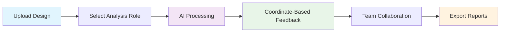

# 🎨 DesignSight - AI-Powered Design Feedback Platform

<div align="center">


**Intelligent design analysis powered by Google Gemini AI**

[](https://reactjs.org/)
[](https://nodejs.org/)
[](https://mongodb.com/)
[](https://ai.google.dev/)

[🚀 Live Demo](https://designsight.tejjj02.repl.co) • [📖 Documentation](./PROJECT_OVERVIEW.md) • [🏗️ Architecture](./ARCHITECTURE.md) • [🐛 Issues](https://github.com/tejjj02/DesignSight/issues)

</div>

---

## ✨ **What is DesignSight?**

DesignSight transforms the design review process through **AI-powered analysis**, providing instant, professional feedback on UI/UX designs. Upload your designs and receive intelligent insights from multiple perspectives - whether you're a designer seeking aesthetic guidance, a developer checking implementation feasibility, or a UX researcher analyzing user experience.

### 🎯 **Key Highlights**

- **🤖 AI-Powered Analysis**: Google Gemini 2.0 Flash integration for intelligent design feedback
- **🎭 Multi-Role Perspectives**: Designer, Developer, UX Researcher, and Product Manager viewpoints
- **📍 Coordinate-Based Feedback**: Precise visual feedback with clickable coordinates
- **💬 Collaborative Comments**: Team discussion and feedback iteration
- **📊 Professional Reports**: Export insights in PDF and JSON formats
- **🎨 Modern UI**: ChatGPT-inspired interface with smooth animations

---


### **💻 Local Development**

**Prerequisites:**
- Node.js 18+ 
- MongoDB (Atlas or local)
- Google Gemini API key ([Get it here](https://ai.google.dev/))

**1-Minute Setup:**
```bash
# Clone and setup
git clone https://github.com/tejjj02/DesignSight.git
cd DesignSight

# Backend setup
cd backend && npm install
cp .env.example .env  # Add your API keys

# Frontend setup  
cd ../frontend && npm install

# Launch (2 terminals)
cd backend && npm start     # Port 5000
cd frontend && npm start    # Port 3000
```

**Access:** `http://localhost:3000`

---

## �️ **Tech Stack**

<details>
<summary><strong>📋 Complete Technology Overview</strong></summary>

### **Frontend Stack**
- **React 18**: Modern hooks, concurrent features
- **CSS3**: Custom properties, animations, responsive design
- **Axios**: HTTP client with interceptors
- **JavaScript ES6+**: Modern syntax and features

### **Backend Stack**
- **Node.js 18+**: Runtime environment
- **Express.js**: Web framework with middleware
- **Multer**: File upload handling
- **Mongoose**: MongoDB object modeling

### **Database & AI**
- **MongoDB Atlas**: Cloud database with indexing
- **Google Gemini 2.0 Flash**: Advanced AI vision model
- **File System**: Local image storage with optimization

### **DevOps & Deployment**
- **Docker**: Containerization support
- **Replit**: Cloud deployment platform
- **GitHub Actions**: CI/CD pipeline ready
- **Environment Variables**: Secure configuration management

</details>

---

## 🎯 **Core Features**

### **🖼️ Intelligent Design Analysis**
- Upload designs in multiple formats (PNG, JPG, JPEG)
- AI-powered feedback generation with contextual insights
- Role-specific analysis perspectives for targeted feedback

### **📍 Interactive Feedback System**
- Visual feedback overlays with precise coordinates
- Clickable feedback points for detailed exploration
- Severity indicators and category-based organization

### **👥 Collaborative Workflow**
- Multi-user commenting system
- Project-based organization and management
- Real-time feedback iteration and discussion

### **📊 Professional Reporting**
- Export comprehensive feedback reports
- PDF generation with visual annotations
- JSON exports for integration with other tools

---

## 🔄 **How It Works**



### **📋 Detailed Workflow**

1. **Project Creation**: Organize designs by project for better management
2. **Image Upload**: Drag-and-drop interface with progress tracking
3. **Role Selection**: Choose perspective (Designer/Developer/UX/PM)
4. **AI Analysis**: Gemini AI processes design with contextual understanding
5. **Visual Feedback**: Interactive overlays show feedback with coordinates
6. **Collaboration**: Team members add comments and iterate on feedback
7. **Export**: Generate professional reports for stakeholders

---

## 📚 **Documentation**

| Document | Description |
|----------|-------------|
| [📖 Project Overview](./PROJECT_OVERVIEW.md) | Comprehensive technical documentation |
| [🏗️ Architecture Guide](./ARCHITECTURE.md) | System design and component structure |
| [🚀 Deployment Guide](./REPLIT_DEPLOYMENT.md) | Production deployment instructions |
| [🔧 API Reference](./PROJECT_OVERVIEW.md#api-endpoints) | Complete API documentation |

---

## 🎨 **Design Philosophy**

DesignSight embraces a **ChatGPT-inspired aesthetic** with:
- Clean, minimal interface design
- Smooth animations and micro-interactions
- Consistent color system with CSS custom properties
- Responsive design for all device sizes
- Accessibility-first approach

---

## 🚦 **API Reference**

<details>
<summary><strong>🔗 Core Endpoints</strong></summary>

### **Projects**
```http
POST   /api/projects           # Create new project
GET    /api/projects           # List all projects  
GET    /api/projects/:id       # Get project details
PUT    /api/projects/:id       # Update project
DELETE /api/projects/:id       # Delete project
```

### **Images**
```http
POST   /api/images/upload      # Upload design image
GET    /api/images/:id         # Get image details
POST   /api/images/:id/analyze # Trigger AI analysis
DELETE /api/images/:id         # Delete image
```

### **Feedback**
```http
GET    /api/feedback/:imageId  # Get image feedback
POST   /api/feedback           # Add manual feedback
PUT    /api/feedback/:id       # Update feedback
DELETE /api/feedback/:id       # Delete feedback
```

### **Comments**
```http
POST   /api/comments          # Add comment
GET    /api/comments/:feedbackId # Get comments
PUT    /api/comments/:id      # Update comment
DELETE /api/comments/:id      # Delete comment
```

</details>

---

## 🤝 **Contributing**

We welcome contributions! Here's how to get started:

### **🔧 Development Setup**
```bash
# Fork the repository on GitHub
git clone https://github.com/YOUR_USERNAME/DesignSight.git
cd DesignSight

# Create feature branch
git checkout -b feature/amazing-feature

# Make your changes and commit
git commit -m "Add amazing feature"

# Push and create Pull Request
git push origin feature/amazing-feature
```

### **📝 Contribution Guidelines**
- Follow existing code style and conventions
- Add tests for new features
- Update documentation as needed
- Ensure all tests pass before submitting

---

## � **Support & Community**

- **🐛 Bug Reports**: [GitHub Issues](https://github.com/tejjj02/DesignSight/issues)
- **💡 Feature Requests**: [GitHub Discussions](https://github.com/tejjj02/DesignSight/discussions)
- **📧 Contact**: [Create an issue](https://github.com/tejjj02/DesignSight/issues/new) for questions

---

## 📄 **License**

This project is licensed under the **MIT License** - see the [LICENSE](./LICENSE) file for details.

---

<div align="center">

**🌟 Star this repository if you find it helpful!**

Made with ❤️ by the DesignSight team

</div>
